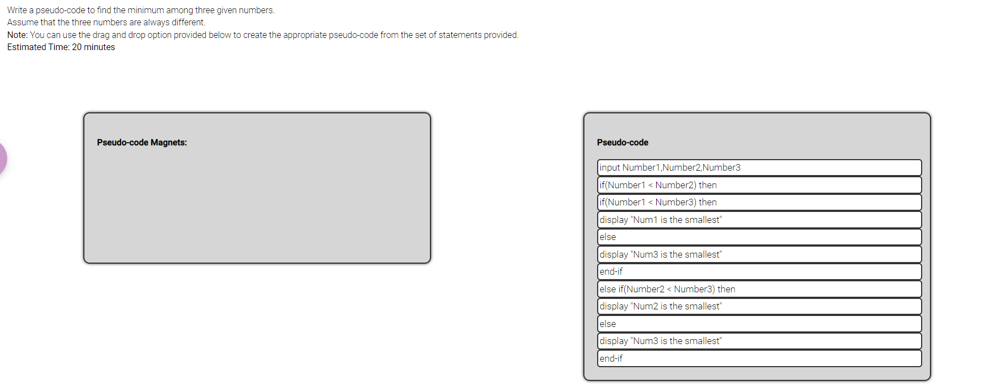
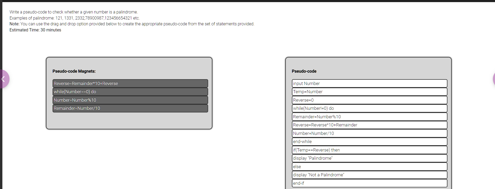

## DAY 1

- Data Types

  1. int
  2. float
  3. bool
  4. imaginary

- Legal ways to define a variable:

  > 1. VAR=100
  > 2. \_var=100
  > 3. varName=100
  > 4. var_name=100

- Illegal ways to define a variable:

  > 1. 7var = 100
  > 2. var name
  > 3. var-name

- Detonator

  > - @test
  > - Special instructions for compiler

- List:

  > - It is editable
  > - var=[10,"Name",1.2j]

- Tuple:

  > - It is not editable
  > - (10, "Name", true)

- Dictionary:

  > - key value pair
  > - Duplicate keys are not allowed

  ```python
      {
          "name": "Shubham",
          "age": 21,
          "edu": ["10th", "HSC", 10],
      }
  ```

- SET:

  > - It only has only values and not keys
  > - Cannot contain duplicate values
  > - var={10,"Name",1.2j}

<br>





@ - it is used to give instructions to the interpreter
